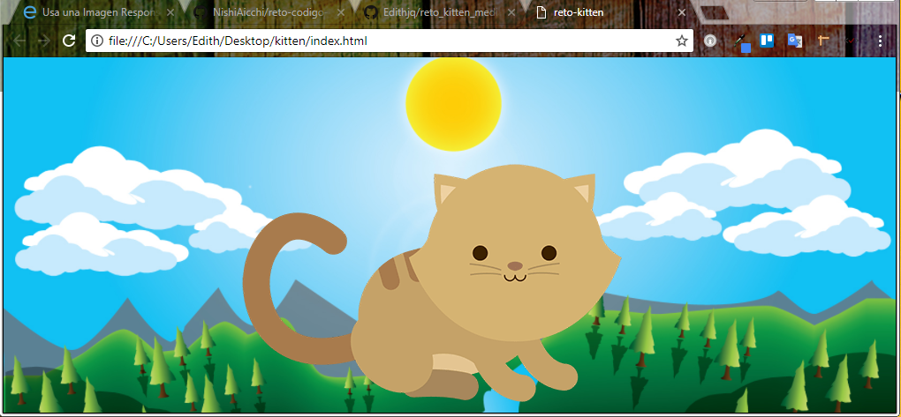
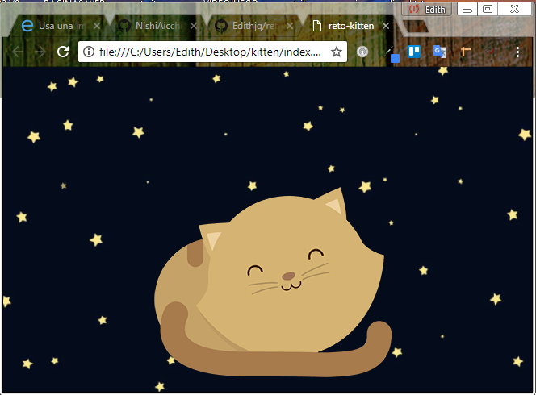
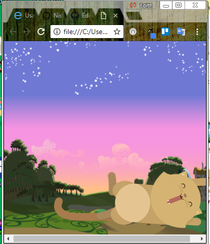

## 1. Kitten

***Crea una página web donde se muestre un paisaje y un gatito diferente a medida que la ventana del navegador se haga más pequeña.***

### Pasos puntuales para realizar el reto
-  Para realizar el reto primero se descargo las imagenes de google drive.

- En este reto se pidio utilizar la regla @media para incluir bloques de propiedades en el css según la condicion dada, en este caso se  empleo las medidas de una tablet, medidas de un movil y la medida por defecto que van al inicio en el css.

